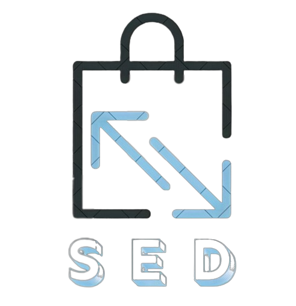

# SED

## What is SED?
SED is a platform focused on merging markets. both  mobile and online. The main focus is on quality, maintainability and stability.

Why is SED so special? It uses clean architectures which is by far more porefull, advanced , performance and security! Also SED is developed under the concept "quality over quantity".

## Motivation
Many people are concerned that their donations to charity may be reduced by tax or administrative costs, preventing the full amount from reaching the people or causes they really want to help. SED will directly connect people each others.

## Contributors
- [Mohamed Adel (Firmeno)](https://github.com/MohamedAdel7799)
	- Front-end
- [Abdelrahman Ezzat](https://github.com/abdoezzat1323)
	- Front-end
- [Abdullah Ragab](https://gitlab.com/)
	- Back-end
- [Mahmoud Elamrosy](https://github.com/melamrosy72)
	- Back-end
- [Mohamed Shehata](https://github.com/MoShehata7920)
	- Mobile Developer
- [Mahmoud Hafez](https://github.com/Bimbum1337)
	- Mobile Developer

## License
This code has been licensed under the *DON'T BE A DICK PUBLIC LICENSE*. For the full license text, see the
[LICENSE.txt](LICENSE.txt) file.

